# Arquitectura Limpia (Clean Architecture) - Marketplace Web

## 1. Resumen del Enfoque Arquitectónico

| Elemento | Descripción aplicada al Marketplace |
|---|---|
| **Patrón / enfoque arquitectónico** | Clean Architecture (Arquitectura Limpia). |
| **Objetivo** | Separar responsabilidades y controlar las dependencias hacia el dominio. |
| **¿Qué problema resuelve?** | Evita el acoplamiento entre la interfaz Angular, las reglas del negocio y las tecnologías externas, como bases de datos, API y servicios de pago. |
| **Capas definidas** | Presentación, Aplicación, Dominio e Infraestructura. |
| **Beneficios** | • Facilita el mantenimiento y las pruebas unitarias. • Permite cambiar implementaciones técnicas sin modificar innecesariamente las reglas del negocio. • Mejora la organización y separación de responsabilidades del código. |

---

## 2. Diagrama de Arquitectura (Mermaid)

```mermaid
graph TB
    subgraph Client ["Cliente"]
        User["👤 Usuario (Cliente)"]
    end

    subgraph AppContainer ["«aplicación» Marketplace Web [Angular 18 · TypeScript] src/app/"]
        direction TB

        subgraph Frameworks ["ADAPTADORES Y FRAMEWORKS — dependen de Angular, HttpClient, RxJS"]
            direction LR

            subgraph Presentacion ["PRESENTACIÓN<br/>src/app/presentacion/"]
                direction TB
                C1["«componente»<br/><b>CatalogoComponent</b><br/><i>lista y filtra productos</i>"]
                S1["«servicio de estado»<br/><b>EstadoCarrito</b><br/><i>signals · sin reglas</i>"]
                C2["«componente»<br/><b>CarritoComponent</b><br/><i>resumen y confirmar compra</i>"]
                C3["«componente»<br/><b>AppComponent</b><br/><i>shell de la aplicación</i>"]
            end

            subgraph Core [" "]
                direction TB

                subgraph Aplicacion ["APLICACIÓN — casos de uso · src/app/aplicacion/"]
                    direction LR
                    UC1["«caso de uso»<br/><b>ConsultarCatalogoCasoUso</b><br/><code>ejecutar()</code>"]
                    UC2["«caso de uso»<br/><b>AgregarAlCarritoCasoUso</b><br/><code>ejecutar()</code>"]
                    UC3["«caso de uso»<br/><b>RegistrarCompraCasoUso</b><br/><code>ejecutar()</code>"]
                end

                subgraph Dominio ["DOMINIO — núcleo · src/app/dominio/"]
                    direction LR
                    subgraph Modelos ["Modelos (entidades y reglas)"]
                        direction TB
                        E1["«entidad»<br/><b>Producto</b><br/><i>stock, categoría, precio</i>"]
                        E2["«entidad»<br/><b>Carrito</b><br/><i>inmutable · subtotal, total</i>"]
                        E3["«entidad»<br/><b>Pedido</b><br/><i>estados · cancelación</i>"]
                        R1["«reglas»<br/><b>precios.ts</b><br/><i>comisión 10% · IGV 18%</i>"]
                    end

                    subgraph Contratos ["Contratos (puertos)"]
                        direction TB
                        I1["«interface»<br/><b>RepositorioProductos</b>"]
                        I2["«interface»<br/><b>RepositorioPedidos</b>"]
                        I3["«interface»<br/><b>ProcesadorPagos</b>"]
                        I4["«interface»<br/><b>NotificadorCliente</b>"]
                    end
                end
                
                TypeScriptInfo["<i>TypeScript puro: sin imports de Angular, HttpClient ni RxJS.<br/>Se verifica sin navegador con npm run pruebas.</i>"]
            end

            subgraph Infraestructura ["INFRAESTRUCTURA<br/>src/app/infraestructura/"]
                direction TB
                A1["«adaptador»<br/><b>RepositorioProductosMemoria</b><br/><b>RepositorioProductosHttp</b>"]
                A2["«adaptador»<br/><b>RepositorioPedidosMemoria</b>"]
                A3["«adaptador»<br/><b>ProcesadorPagosSimulado</b><br/><b>ProcesadorPagosNiubiz</b>"]
                A4["«adaptador»<br/><b>NotificadorConsola</b><br/><b>NotificadorWhatsApp</b>"]
                DI1["«Angular DI»<br/><b>tokens.ts</b><br/><i>InjectionToken por contrato</i>"]
            end
        end

        AppConfig["«raíz de composición»<br/><b>app.config.ts</b><br/><i>único archivo que elige qué adaptador cumple cada contrato (useFactory o InjectionToken) y lo inyecta en los casos de uso</i>"]
    end

    ExternalAPI["«sistema externo»<br/><b>Marketplace API REST</b><br/>Backend Node.js · monolito modular<br/><br/>/api/productos<br/>/api/pedidos<br/>/api/authorization<br/>/api/mensajes<br/><br/><i>Se integra con Niubiz y WhatsApp;<br/>las credenciales viven solo aquí.</i>"]

    %% Conexiones e interacción
    User -- "navegador" --> Presentacion
    Presentacion -- "invoca" --> Aplicacion
    S1 -. "dependencia de código (import)" .-> E2

    %% Inversión de dependencias (Implementación de contratos)
    A1 -. "implementa contrato" .-> I1
    A2 -. "implementa contrato" .-> I2
    A3 -. "implementa contrato" .-> I3
    A4 -. "implementa contrato" .-> I4

    %% Registro de DI y comunicación externa
    AppConfig -. "registra" .-> DI1
    Infraestructura -- "HTTP / JSON" --> ExternalAPI
```

---

## 3. Convenciones y Reglas de la Arquitectura

### Leyenda
* **`───>` Llamada en tiempo de ejecución:** Flujo de ejecución síncrono/asíncrono de los componentes a los casos de uso o de infraestructura a APIs externas.
* **`- - ->` Dependencia de código (import):** Siempre apunta hacia el centro (hacia el Dominio).
* **`- - ->` Implementa el contrato definido en el dominio:** Inversión de dependencia donde la capa exterior implementa las interfaces del núcleo.
* **Anillos de cebolla:** `Dominio` ⊂ `Aplicación` ⊂ `Adaptadores y Frameworks`.

### Reglas de Dependencia
1. **El dominio no importa nada de las capas externas:** Debe mantenerse agnóstico a cualquier framework, HTTP o almacenamiento.
2. **Los casos de uso solo conocen entidades y contratos:** Solo manipulan lógica de la aplicación y puertos abstractos.
3. **Los adaptadores implementan contratos:** Son intercambiables entre sí (ej. cambiar de `Memoria` a `Http` sin tocar lógica).
4. **Cambiar de tecnología = cambiar `app.config.ts`:** No se modifica el dominio ante cambios técnicos.